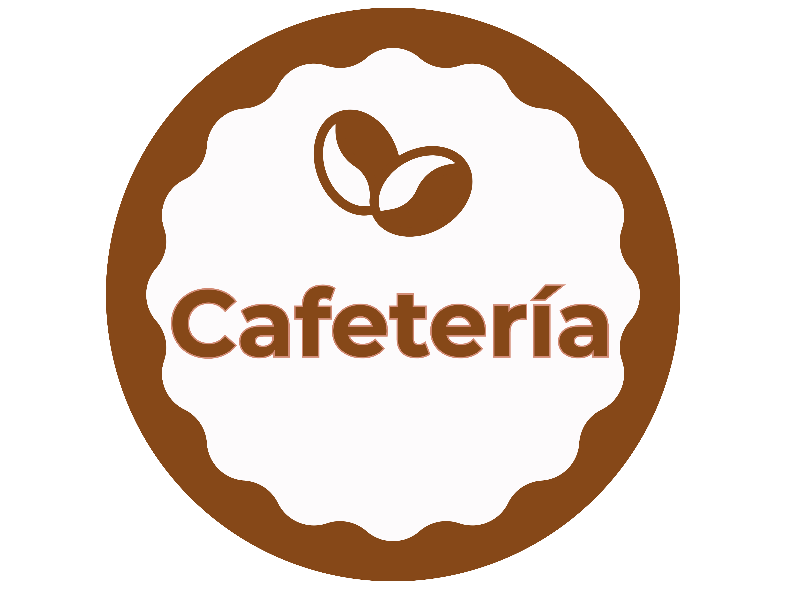

  

  

<h1 align="center" style="color: green;">🧠 Cafeteria ® 🧠</h1>

---

A sleek and responsive frontend project for coffee shops in Spain, built with React, Next.js, and Tailwind CSS.

📌 Project Overview
This project is a modern, responsive website designed for coffee shops in Spain. It features a clean aesthetic and interactive components that highlight interesting facts about each establishment. The site is built entirely on the frontend, focusing on enhancing development skills and user experience.

🚀 Tech Stack
TypeScript

React

Next.js

Tailwind CSS

HTML & CSS

📄 Pages
Inicio (Home) – Welcoming landing page

Carta (Menu) – Showcasing the café's offerings

Contacto (Contact) – Contact form and location details

Legal Pages – User data protection and company information

🌍 External APIs
Google Maps JavaScript API – Interactive map integration

Google Places API – Displaying nearby points of interest

Google Geocoding API – Address and location data handling

📷 Preview

🛠️ Getting Started
To run this project locally:

bash
Copy
Edit
git clone https://github.com/NickeAlves/cafeteria.git
cd cafeteria
npm install
npm run dev
📬 Contact
Feel free to reach out for feedback or collaboration:
